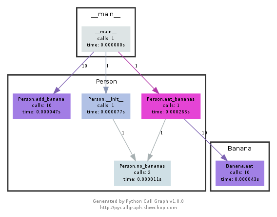

## Debugging and Profiling
A golden rule in programming is that code does not do what you expect it to do, but what you tell it to do.

“The most effective debugging tool is still careful thought, coupled with judiciously placed print statements”
* A first approach to debug a program is to add print statements around where you have detected the problem, and keep iterating until you have extracted enough information to understand what is responsible for the issue.
* 2nd approach is to use logging in your program instead of ad hoc print statements 

Logging is better since:
- You can log to files, sockets, or even remote servers instead of standard output
- Logging supports severity levels
- New issues may appear better in logging


**TIP: make logs more readable by coloring code them**

### Third Party Logs
As you start building larger software systems you will most probably run into dependencies that run as separate programs

In UNIX systems, it is commonplace for programs to write their logs under `/var/log`
On Mac you can use `log show`

For logging under the system logs you can use the logger shell program.

```
logger "Hello Logs"
# On macOS
log show --last 1m | grep Hello
# On Linux
journalctl --since "1m ago" | grep Hello
```


## Debuggers


When printf debugging is not enough you should use a debugger. Debuggers are programs that let you interact with the execution of a program
In Python the debugger is `pdb`

There are commands that pdb supports. Note that since Python is an interpreted language we can use the pdb shell to execute commands and to execute instructions. ipdb is an improved pdb that uses the IPython


Whenever programs need to perform actions that only the kernel can, they use `System Calls`. There are commands that let you trace the syscalls your program makes.
In Linux there’s `strace` and macOS and BSD have `dtrace` or better `dtruss`

Some circumstances you meed need to look at the network packets to figure out the issue in your program. Tools like `tcpdump`
- Read contents of the network packets


### Static Analysis
Static analysis programs take source code as input and analyze it using coding rules to reason about its correctness.

There are also listing tools and code formatters that help with stylizing the code to look better for reading 


### Profilers

Premature optimization is root of all evil. Profilers help understand which parts of your program are taking the most of theme and/or resources so you can optmize

#### Timing
Similarly to the debugging case, in many scenarios it can be enough to just print the time it took your code between two points. Here is an example in Python using the time module.
- HOWEVER THIS CAN BE MISLEADING, as your computer can be running other processes

In general, User + Sys tells you how much time your process actually spent in the CPU (more detailed explanation here).
- https://stackoverflow.com/questions/556405/what-do-real-user-and-sys-mean-in-the-output-of-time1

You can also use the `time` command in bash

CPU PROFILER
There are 2 main types of CPU profilers: tracing and sampling

**Tracing keeps a record of every function call your program makes**

**Sampling probe your program periodically and record the program’s stack**


Sometime there is a caveat with tracing as it can become unintuitive fast if you look at each time per function call.
- More intuitive is to display info on time taken per line of code
- LINE PROFILERS


MEMORY PROFILERS
Sometimes programs can cause your program to never release memory that it doesn’t need anymore
- Can use tools to debug for memory


### Visualization

One common way to display CPU profiling information for sampling profilers is to use a Flame graph.

Call graphs or control flow graphs display the relationships between subroutines within a program by including functions as nodes and functions calls between them as directed edges
- For example in Python you can use pycallgraph




### Resource Monitoring

Analyzing the performance of a program can be done with understanding the actual resource consumption
- Programs can run slowly when they are resource constrained -> no memory or slow network connection


| Type | Description  |
| :---:   | :---: | 
| General Monitoring | `htop` is most popular, presents various statistics for current running processes, dstat is also another tool that grabs more aggregate data. Also glances   | 
| I/O Operations | The command, iotop, displays live I/O usage information |
| Disk Usage | The command, `df`, displays metrics per partition and ,`du`, displays disk usage for current directory |
| Memory Usage | The command,`free`, displyas the total amount of free and used memory in the system |
| Network Connections | For displaying routing, and network devices/interfaces you can use, `ip` command |

If you want to test these tools you can also artificially impose loads on the machine using the `stress` command


## Exercises
1. Did the following tutorial: https://github.com/spiside/pdb-tutorial
- there are 5 `pdb` commands

1. `l` (list) - displays 11 lines around the current line or continue the previous listing
2. `s` (step) - execute the current line
3. `n (next) - continue the execution until the next line in the current function is reached
4. `b` (break) - set a breakpoint
5. `r` (return) - continue execution until the current function returns

2. The next exercise was installing `shellcheck` to check a bash script

### Profiling
1. Opened a web server to listen to it on another terminal to look for PID and killed it 
2. Downloaded `stress` and `htop`
